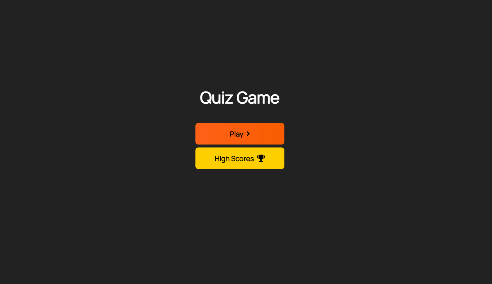

# How to play 🎮🎲

 📜 This is a TRIVIA GAME

 ✏️ 5 questions
 
 ⏰ 40 seconds to answer

 ❌ Every incorrect answer = -10 seconds

 ✔️	Every correct answer = 100 points 


# Technologies used 

- [x] HTML
- [x] Javascript
- [x] CSS
- [x] FontAwesome
- [x] Bootstrap
- [x] jQuery


# What I learned from this assignment 

* Improved ways to create my code in HTML setting classes and ID's all at once "#home.flex-colum.flex-center" press TAB.

* Learned new skills on how to better use "rem" as size on my CSS

* Improved my ability to work with if & else statement

* Improved my ability to find and fix errors also how improve the quality of the code on JavaScript

# Preview



## Important Change Log for errors / bugs while reviewing the code

- [x] Added Media Query for mobile version

```
@media screen and (max-width: 768px) {
    .choice-container {
        min-width: 20rem;
        font-size: 2.0rem;
    }
    .container {
        margin-top: 20px
    }
    #question {
        font-size: 25px;
    }
}
```

- [x] Fixed number of questions passing the MAX number established 
```
wrong: if(availableQuestions.length === 0 || questionCounter > MAX_QUESTIONS) {
correct: if(availableQuestions.length === 0 || questionCounter >= MAX_QUESTIONS) {
```

- [x] Added 'clear' button to erase the score
```
$("#clear").on("click", function (event) {
    $("#highScoresList").empty();
});
```

- [x] Added function to clean the storage and make the values not return when refreshing the page 
```
refreshing the page
$("#clear").on("click", function (event) {
    window.localStorage.clear();
}); 
```

